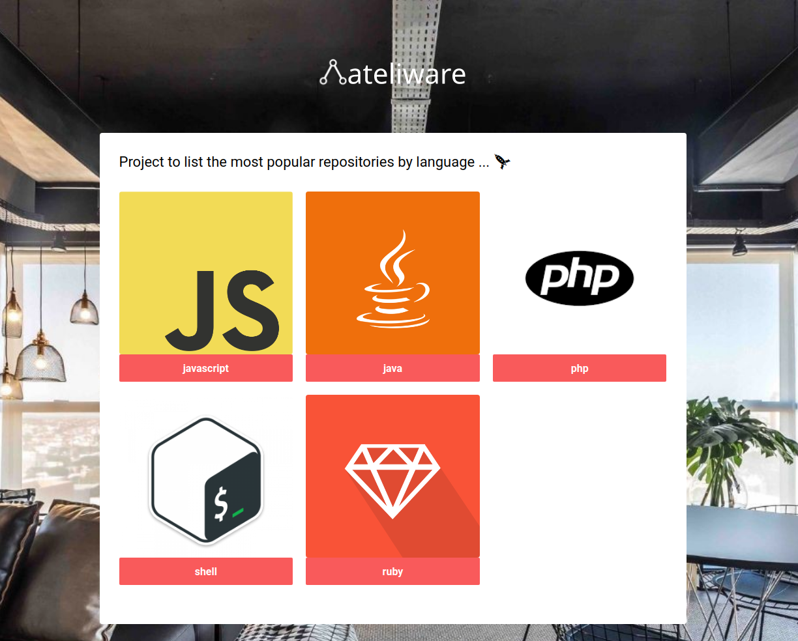
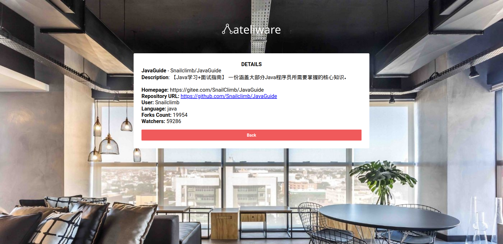

# Ateliware Frontend application

Application to list popular repositories on GitHub by language!

## Running local

```bash
$ cp .env.example .env
$ yarn install
$ yarn start
```

## Running application on docker
```bash
$ docker-composer up -d --build --force-recreate
```
Access localhost on browser

> http://localhost:3000

## DEMO

CLick [here](https://ateliware-frontend.herokuapp.com/)
 and see application running on heroku

## Preview images

### List Languages



### List Repositories


### Show Detail Repository


